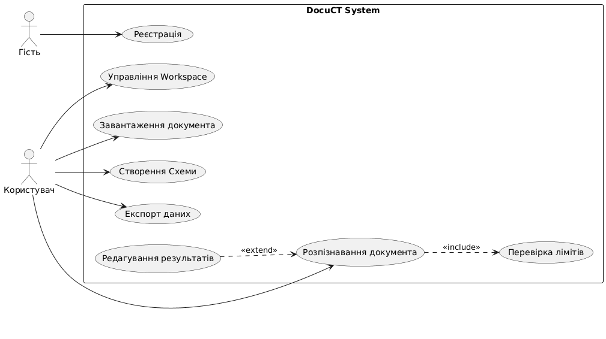

# Лабораторна робота №2. Моделювання програмної системи засобами UML
**Виконав:** студент групи ПЗПІ-25-5, Нижник Владислав
**Предметна область:** AI-сервіс аналізу документів DocuCT (результат роботи ПЗ 1 та ПЗ 2)

## Крок 2. Функціональні вимоги до системи
| ID | Функціональна вимога |
| :--- | :--- |
| **FR-01** | Система має дозволяти гостю зареєструватися та створити обліковий запис. |
| **FR-02** | Система має дозволяти користувачу створювати ізольовані робочі простори (Workspaces). |
| **FR-03** | Система має дозволяти користувачу завантажувати PDF-документи в Workspace. |
| **FR-04** | Система має дозволяти користувачу створювати "Схеми" (Schema) для вказівки полів розпізнавання. |
| **FR-05** | Система має автоматично розпізнавати завантажений документ за обраною схемою за допомогою ШІ. |
| **FR-06** | Система має дозволяти користувачу експортувати вилучені дані у форматах CSV або JSON. |

## Крок 3. Діаграма прецедентів (Use Case Diagram)

## Крок 4. Діаграма класів (Class Diagram)

## Крок 5. Діаграма послідовності (Sequence Diagram)

## Крок 6. Матриця трасовності (Traceability Matrix)

| Вимога (ID) | Use Case | Задіяні Класи | Sequence Diagram |
| :--- | :--- | :--- | :--- |
| **FR-01** | Реєстрація (UC1) | User | — |
| **FR-02** | Управління Workspace (UC2) | User, Workspace | — |
| **FR-03** | Завантаження документа (UC3) | Workspace, Document | SD-01 (Завантаження документа) |
| **FR-04** | Створення Схеми (UC4) | Workspace, Schema | — |
| **FR-05** | Розпізнавання документа (UC5) | Document, Schema, AIParser | SD-01 (Розпізнавання документа) |
| **FR-06** | Експорт даних (UC7) | Document | — |
